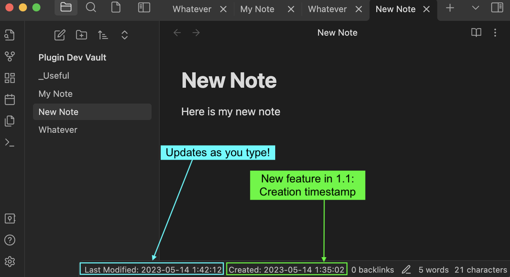
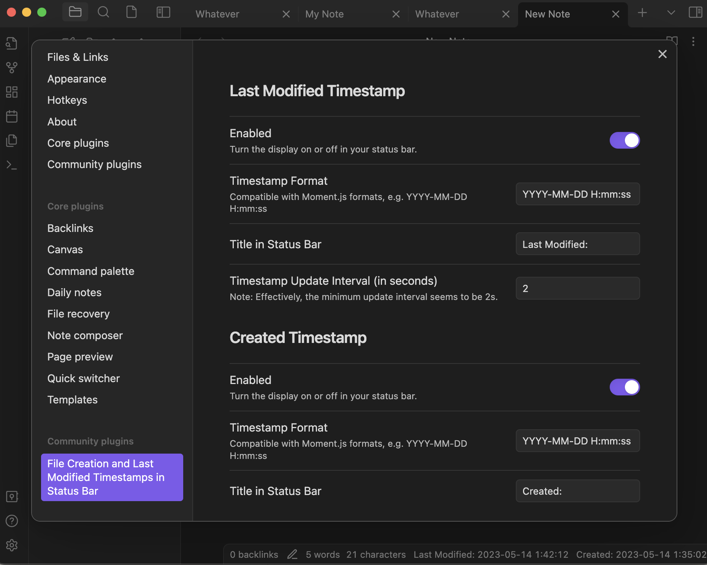

# Last Modified Timestamp in Status Bar
Displays the last modified timestamp of your current note on your status bar!

## Usage
The timestamp updates frequently (every 2 seconds, and when notes are switched).

## Customizability
- Timestamp format for both **created** and **last modified** timestamps
- Timestamp title in status bar for both **created** and **last modified** timestamps
- Refresh interval for **last modified** timestamp

